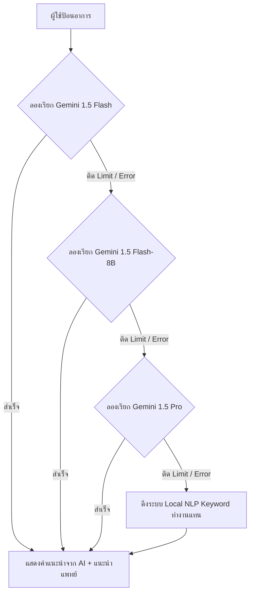

# 🩺 ClickCare Telemedicine Application

**ClickCare** เป็นเว็บแอปพลิเคชันสำหรับการดูแลรักษาสุขภาพทางไกล (Telemedicine) แบบออนไลน์ครบวงจร ช่วยให้ผู้ป่วยสามารถค้นหาแพทย์ตามแผนกต่าง ๆ ปรึกษาปัญหาสุขภาพเบื้องต้นผ่านระบบ AI Symptom Checker และทำนัดหมายตรวจออนไลน์ (Video Consult) ได้ทันทีในคลิกเดียว

---

## 🌟 ฟีเจอร์เด่น (Key Features)

- **🤖 AI Symptom Checker (ระบบวิเคราะห์อาการด้วย AI):**
  - วิเคราะห์อาการเบื้องต้น แนะนำระดับความเสี่ยงและความเร่งด่วน พร้อมแผนกเฉพาะทางที่เหมาะสม
  - **ระบบ Fallback อัตโนมัติ:** เมื่อโมเดลหลักติดขีดจำกัด (Limit 429) ระบบจะสลับไปทดลองใช้โมเดลอื่นทันทีตามลำดับ: `gemini-1.5-flash` ➡️ `gemini-1.5-flash-8b` ➡️ `gemini-1.5-pro`
  - **ระบบสำรองออฟไลน์ (NLP Fallback):** หากเกิดเหตุขัดข้องของ API ทั้งหมด ระบบจะดึงระบบวิเคราะห์คำหลักภายใน (Keyword NLP) มาทำงานแทนทันทีเพื่อไม่ให้ระบบสะดุด
- **🏥 Specialist Directory:** ค้นหาแพทย์ผู้เชี่ยวชาญจาก 9 แผนกหลัก เช่น หัวใจ, ผิวหนัง, กุมารเวชกรรม, ประสาทวิทยา, และจิตเวช
- **👨‍⚕️ Doctor Dashboard (สำหรับแพทย์):** ระบบจัดการคิวคนไข้วันนี้, ตารางนัดหมาย, สถิติจำนวนคนไข้ และคะแนนรีวิวของคุณหมอ
- **📅 Appointment Management:** จัดการนัดหมายและประวัติการรักษาออนไลน์ของผู้ป่วย
- **📱 Responsive UI & Premium Design:** หน้าจอสไตล์คลีน ทันสมัย รองรับการใช้งานผ่านมือถือและเดสก์ท็อป

---

## 🛠️ เทคโนโลยีที่ใช้ (Tech Stack)

- **Frontend:** React 19.x, React Router DOM v7, Vite, TypeScript
- **Styling:** Vanilla CSS, Lucide React (Icons)
- **Charts/Analytics:** Chart.js, react-chartjs-2
- **AI Engine:** Google Gemini Developer API (REST Endpoint)

---

## ⚙️ การตั้งค่าและเริ่มใช้งาน (Getting Started)

### 1. โคลนโปรเจกต์และติดตั้ง Dependencies
เปิด Terminal ในโฟลเดอร์โปรเจกต์ `clickcare-app` แล้วรันคำสั่ง:
```bash
npm install
```

### 2. ตั้งค่าตัวแปรสภาพแวดล้อม (Environment Variables)
สร้างไฟล์ `.env` ที่โฟลเดอร์ Root ของ `clickcare-app` และใส่คีย์ของ Google Gemini API:
```env
VITE_GEMINI_KEY=AIzaSyYourGeminiApiKeyHere...
```
*(หมายเหตุ: สามารถรับคีย์ใช้งานฟรีได้ที่ [Google AI Studio](https://aistudio.google.com/))*

### 3. รันโปรเจกต์ในโหมดพัฒนา (Development Mode)
```bash
npm run dev
```
ระบบจะเปิดใช้งานเซิร์ฟเวอร์จำลอง มักจะเข้าชมได้ทาง [http://localhost:5173](http://localhost:5173)

### 4. การ Build สำหรับ Production
```bash
npm run build
```

---

## 🧠 สถาปัตยกรรมการทำงานของระบบวิเคราะห์อาการ (AI Flow)



---

## 📂 โครงสร้างโฟลเดอร์หลัก
```text
clickcare-app/
├── public/              # ไฟล์ Static (เช่น sw.js, manifest.json)
├── src/
│   ├── context/         # Auth และ Toast Context
│   ├── pages/           # หน้าเว็บเพจต่างๆ (HomePage, DoctorDashboard, etc.)
│   │   ├── HomePage.jsx
│   │   ├── HomePage.css
│   │   └── ...
│   ├── main.jsx         # จุดเริ่มต้น React Application
│   └── index.css        # ไฟล์ CSS หลักของแอปพลิเคชัน
├── .env                 # ไฟล์เก็บคีย์ของ Gemini
├── test-api.js          # สคริปต์จำลองทดสอบสลับโมเดล API
└── package.json         # รายการแพ็คเกจและสคริปต์
```
